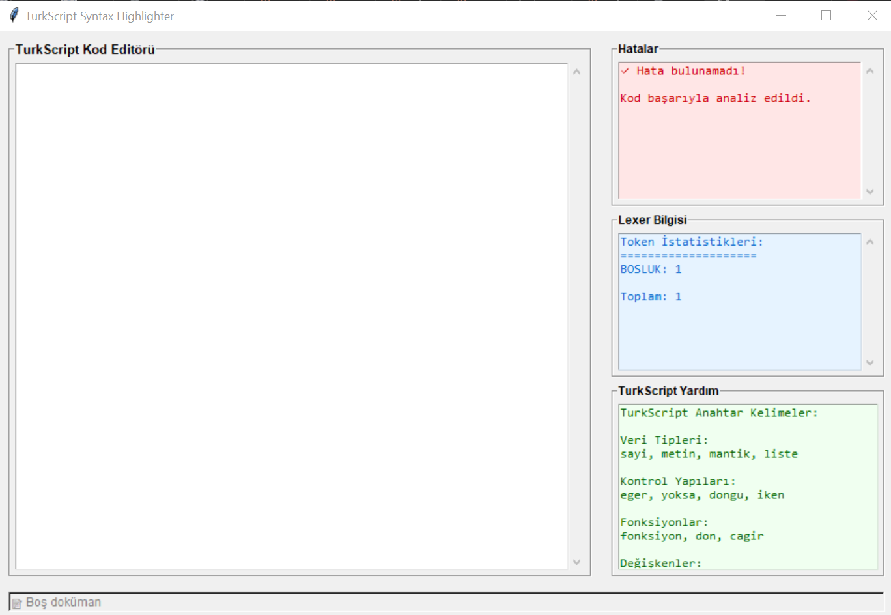

# TurkScript Syntax Highlighter 🚀
TurkScript dilinde yazılmış kodlar için gerçek zamanlı sözdizimi vurgulaması yapan GUI uygulaması. Bu proje, Türkçe anahtar kelimelerle çalışan özgün bir programlama dili olan TurkScript için lexical analyzer, parser ve syntax highlighter içerir.


## Proje Hakkında 📝
Bu uygulama, modern compiler tasarım prensiplerini kullanarak gerçek zamanlı kod analizi ve sözdizimi vurgulaması sağlar. TurkScript, tamamen Türkçe anahtar kelimelerle tasarlanmış özgün bir programlama dilidir.


### Özellikler ⭐
- **Gerçek Zamanlı Syntax Highlighting**: 300ms gecikme ile anlık renklendirme
- **Leksikal Analiz**: 10 farklı token türünü tanıyan lexer
- **Sözdizimi Analizi**: Top-down parser ile grammar kontrolü
- **Hata Yönetimi**: Lexical ve syntax hatalarının detaylı raporlanması
- **Kullanıcı Dostu GUI**: Tkinter ile geliştirilmiş modern arayüz
- **Türkçe Dil Desteği**: Tamamen Türkçe anahtar kelimeler

### TurkScript Dili 💻
```turkscript
// TurkScript Örneği
degisken sayi x = 10;
degisken metin isim = "Edem";

eger (x > 5) {
    yazdir("x büyük bir sayı");
} yoksa {
    yazdir("x küçük bir sayı");
}

fonksiyon topla(a, b) {
    don a + b;
}

degisken sonuc = cagir topla(5, 3);
yazdir(sonuc);
```


## Ekran Görüntüleri 📸

### Ana Arayüz


### Syntax Highlighting Örneği


### Hata Raporlama


## Kurulum ve Çalıştırma 🛠️

### Gereksinimler
- Python 3.7 veya üzeri
- Tkinter (Python ile birlikte gelir)

### Kurulum Adımları
1. Projeyi GitHub'dan klonlayın:
```bash
git clone https://github.com/makhsudov/SyntaxHighlighter.git
cd SyntaxHighlighter
```
2. `src` klasörüne gidin:
```bash
cd src
```
3. Uygulamayı çalıştırın:
```bash
python main.py
```

### Dosya Yapısı
```
src/
├── main.py                 # Ana uygulama dosyası
├── gui.py                  # GUI arayüzü
├── lexer.py                # Leksikal analizci
├── turkscript_parser.py    # Sözdizimi analizcisi
└── turkscript_grammar.py   # Dil gramerı ve tanımları
```


## Teknik Detaylar ⚙️

### Mimari
- **Lexer**: State Diagram & Program Implementation yaklaşımı
- **Parser**: Top-Down (Recursive Descent) Parser
- **GUI**: Tkinter framework ile responsive tasarım
- **Real-time Analysis**: Debounce mechanism ile performans optimizasyonu

### Token Türleri
- ANAHTAR_KELIME (eger, dongu, fonksiyon)
- TANIMLAYICI (değişken adları)
- SAYI (123, 45.67)
- METIN ("merhaba", 'dünya')
- OPERATOR (+, -, ==, !=)
- AYIRICI ((, ), {, }, ;)
- YORUM (// yorum satırı)
- HATA (tanınmayan karakterler)


## Dokümantasyon ve Kaynaklar
- **Demo Video**: [YouTube'da İzle](https://youtu.be/b8V-WN-o0so)
- **Teknik Makale**: [Medium'da Oku](https://medium.com/@makhsudov/turkscript-python-ile-lexer-parser-ve-real-time-syntax-highlighting-geli%C5%9Ftirme-5905bed229d6)
- **Proje Dokümantasyonu**: [PDF İndir](docs/Documentation.pdf)


## Kullanım ⌨️
1. Uygulamayı başlatın
2. Sol paneldeki kod editörüne TurkScript kodunuzu yazın
3. Gerçek zamanlı syntax highlighting ve hata kontrolü görün
4. Sağ panelde token istatistikleri ve hata raporlarını inceleyin


## Örnek TurkScript Kodları

### Değişken Tanımlama
```turkscript
degisken sayi yas = 25;
degisken metin ad = "Edem";
degisken mantik aktif = dogru;
```

### Koşullu İfadeler
```turkscript
eger (not >= 90) {
    yazdir("A");
} yoksa eger (not >= 80) {
    yazdir("B");
} yoksa eger (not >= 70) {
    yazdir("C");
} yoksa {
    yazdir("F");
}
```

### Fonksiyonlar
```turkscript
fonksiyon selamla(isim) {
    yazdir("Merhaba " + isim);
}

cagir selamla("Dünya");
```


## Proje Bilgileri 👤
- **Geliştirici**: Edem Makhsudov
- **Öğrenci No**: 22360859373
- **Üniversite**: Bursa Teknik Üniversitesi
- **Bölüm**: Bilgisayar Mühendisliği
- **Ders**: BLM0238 Programlama Dilleri


---

_**Not**: Bu proje "Real-Time Grammar-Based Syntax Highlighter with GUI" projesi kapsamında geliştirilmiştir._
